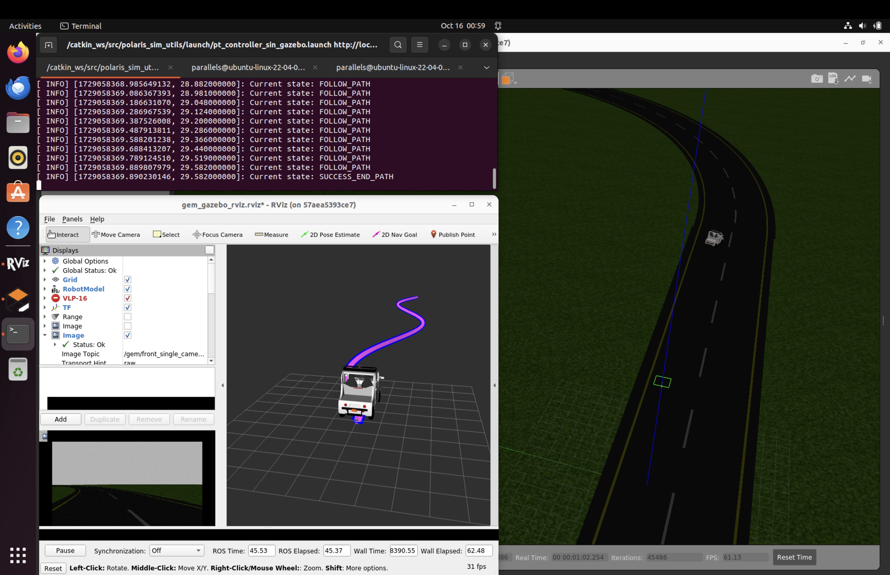
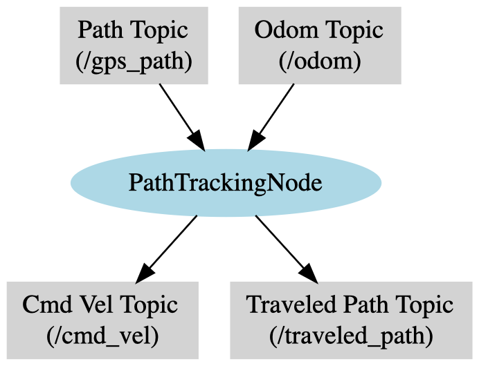
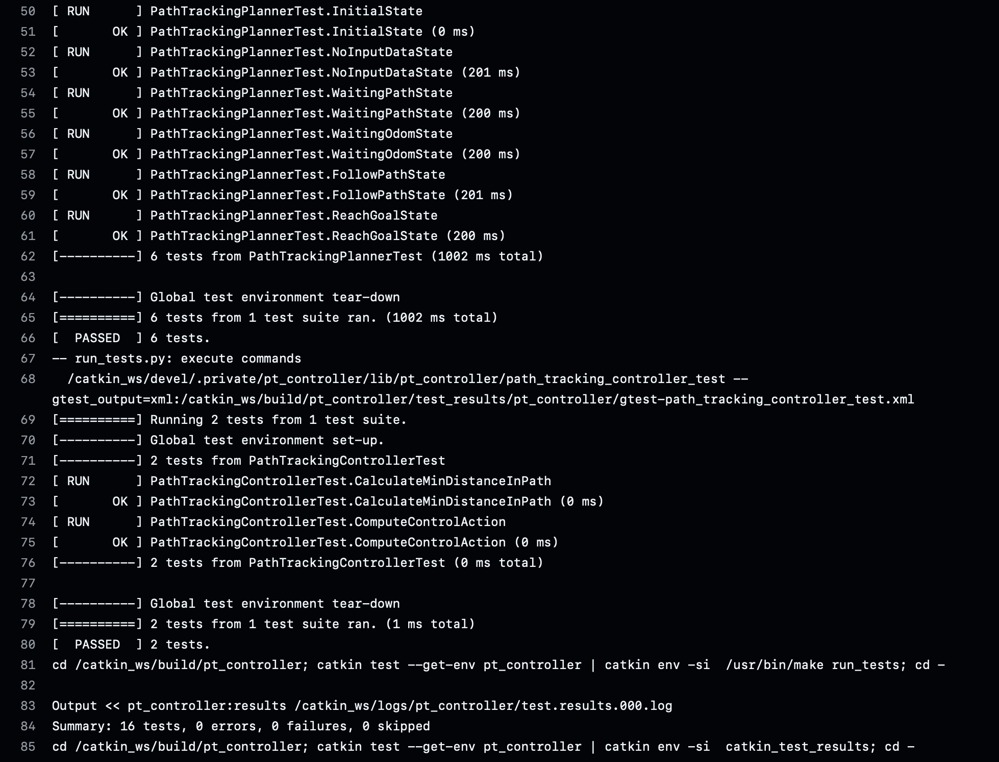

# Polaris GEM e2 Simulation and Path Tracking Controller

This repository contains two main packages for ROS Noetic: [polaris_sim_utils](./catkin_ws/src/polaris_sim_utils) and [pt_controller](./catkin_ws/src/pt_controller). These packages are designed to work together to provide utilities for the Polaris GEM e2 vehicle and to control its path tracking in a ROS environment. The main goal for this projec was develop the [pt_controller](./catkin_ws/src/pt_controller) package to control the Polaris GEM e2 vehicle to follow a predefined path.



## Polaris Simulation Utilities

The [polaris_sim_utils](./catkin_ws/src/polaris_sim_utils) package contains utilities and tools to launch the Polaris GEM e2 vehicle and generate some helper paths to validate the controllers provided by the [pt_controller](./catkin_ws/src/pt_controller) package.

### Features

- **Utility Scripts**: Scripts to generate helpful paths.
- **Launch Files**: Pre-configured launch files to execute simulation or just the controller with paths.
- **RVIZ File**: Custom rviz configuration to validate the path tracking, based on the rviz configuration provided by Polaris GEM e2 vehicle.

## Path Tracking Controller (pt_controller)

The `pt_controller` package contains the implementation of a path-tracking controller for the Polaris GEM e2 vehicle. This controller is responsible for following a predefined path using feedback from the vehicle's odometry.

### Features

- **Path Tracking Planner**: Plans the path for the vehicle to follow.
- **Path Tracking Controller**: Controls the vehicle to follow the planned path by adjusting linear and angular velocities dynamically.

## Architecture and Code Design

The [pt_controller](./catkin_ws/src/pt_controller) package is designed with a modular architecture to separate the concerns of path planning and path following. The main components are the [PathTrackingPlanner](./catkin_ws/src/pt_controller/src/PathTrackingPlanner.cpp) and the [PathTrackingController](./catkin_ws/src/pt_controller/src/PathTrackingController.cpp).

#### PathTrackingController

The [PathTrackingController](./catkin_ws/src/pt_controller/src/PathTrackingController.cpp) is responsible for generating the control actions (linear and angular velocities) that guide the vehicle along the path. It calculates control actions using a feedback control algorithm based on the Pure Pursuit technique.

**Example Code:**

```cpp
std::vector<double> PathTrackingController::computeControlAction(
    const std::vector<double>& position,
    const std::vector<double>& lookahead_point)
{
    if (position.size() != 3)
    {
        ROS_WARN("Position must have 3 elements: x, y, yaw.");
        return {0.0, 0.0};
    }

    double robot_x = position[0];
    double robot_y = position[1];
    double robot_yaw = position[2];

    double lookahead_x = lookahead_point[0];
    double lookahead_y = lookahead_point[1];

    double dx = lookahead_x - robot_x;
    double dy = lookahead_y - robot_y;
    double angle_to_goal = atan2(dy, dx);
    double alpha = angle_to_goal - robot_yaw;

    alpha = atan2(sin(alpha), cos(alpha));

    double kappa = (2 * sin(alpha)) / lookahead_distance_;

    double alignment_factor = cos(alpha);
    double linear_speed = max_linear_speed_ * std::max(alignment_factor, 0.0);
    double angular_speed = linear_speed * kappa;

    return {linear_speed, angular_speed, alpha, kappa};
}
```

#### PathTrackingPlanner

The [PathTrackingPlanner](./catkin_ws/src/pt_controller/src/PathTrackingPlanner.cpp) manages the state for the [PathTrackingController](./catkin_ws/src/pt_controller/src/PathTrackingController.cpp). It handle the execution of path tracking based on the current state of path and odometry data availability, and vehicle's goal-reaching status.

#### Key Components and Functionality

- **State Management**: Manages various operational states such as initialization, error handling, and successful completion of path tracking.
- **Threaded Execution**: Runs its monitoring logic in a separate thread to regularly check the status and progression of path tracking.
- **Control Delegation**: Delegates the computation of control commands to the `PathTrackingController`, ensuring that actions are based on the latest available data.

#### PathTrackingNode
PathTrackingNode is the ROS node provided that integrates the PathTrackingPlanner and PathTrackingController. It subscribes to the path and odometry topics, updates the planner's state based on the received data, and publishes the control commands to the vehicle.

An example of the usage of the PathTrackingNode can be found in the launcher file [pt_controller_example](./catkin_ws/src/pt_controller/launch/pt_controller_example.launch)



#### Workflow Description

1. **Initialization**: Starts in the INIT state and checks for controller availability.
2. **State Monitoring**: Continuously monitors and updates the state based on path and odometry data availability:
   - **WAITING_PATH**: Triggered if path data is missing.
   - **WAITING_ODOM**: Triggered if odometry data is missing.
   
   - **FOLLOW_PATH**: Engaged when both path and odometry data are sufficient for path tracking.
3. **Error Handling and Goal Achievement**: Manages errors and checks if the goal is reached, stopping the vehicle if necessary.

#### Example Usage

```cpp
PathTrackingPlanner planner(10.0, &controller, [&](PathTrackingState state){
    std::cout << "State updated to: " << planner.stateToString(state) << std::endl;
});
planner.execute();
```

## Design Choices

- **Modular Design**: The simulation and control logic are separated into distinct packages (`polaris_sim_utils` for simulation utilities and `pt_controller` for path tracking). This makes the system more flexible and scalable for future developments.
  
- **Path Following with Pure Pursuit**: The control strategy for path tracking leverages the Pure Pursuit algorithm, which is simple yet effective for real-time control of autonomous vehicles. By dynamically adjusting the speed based on alignment, the controller ensures smooth and adaptive path following.

## Dockerfile

This project includes two Dockerfiles for different purposes:

### Dockerfile.Desktop

The Dockerfile.Desktop configures a ROS Noetic environment tailored for the Polaris GEM e2 vehicle, featuring a full desktop installation. This setup includes all necessary dependencies and tools required for the development of the path-tracking controller.

### Dockerfile.Prod

The `Dockerfile.Prod` establishes a minimal ROS Noetic environment, including core packages and dependencies necessary for the [pt_controller](./catkin_ws/src/pt_controller/) ROS package.

## Installation

This project is based on containers with [ROCKER](https://github.com/osrf/rocker). For detailed installation instructions, please follow the steps provided in this repository to run the graphical interface [ROS_Rocker_Turtlebot3SimNoetic](https://github.com/aldajo92/ROS_Rocker_Turtlebot3SimNoetic).

## Usage

### For Desktop Environment

**Update submodules:**
This dekstop environment depends on the [POLARIS_GEM_e2](https://gitlab.engr.illinois.edu/gemillins/POLARIS_GEM_e2) package wich is included as a submodule. To make sure to have the latest version of this repository at [catkin_ws/src](./catkin_ws/src) folder, you can run the following command:

```bash
git submodule update --init --recursive
```

**Build the Docker.Desktop environment:**

To build the Docker.Desktop environment, you can run the following command:

```bash
./scripts/build
```

**Run the Docker.Desktop environment:**

After building the Docker.Desktop environment, you can run the container with the following commands:

```bash
./scripts/run_cpu ## Use the CPU without Nvidia GPU acceleration
./scripts/run_nvidia ## Use the CPU without Nvidia GPU acceleration
```

**Build the ROS packages:**
The container will open a bash terminal. And you will have the shared catkin_ws folder to interac with the sourcecode. You can build the ROS packages with the following commands:

```bash
bros ## It is an alias to build the ROS packages.
sros ## It is an alias to source the ROS packages.
```

It is important to source the ROS packages to use the ROS commands. The alias definitions can be found at the end of [Docker.Dekstop](./Dockerfile.Desktop) file.

**Launching the Simulation and Path Tracking Controller:**

After run the container, a bash terminal will be opened. Then, you can launch the simulation and the path tracking controller, based on the launcher file [pt_controller_gazebo.launch](./catkin_ws/src/polaris_sim_utils/launch/pt_controller_gazebo.launch), with the following commands:
```bash
roslaunch polaris_sim_utils pt_controller_gazebo.launch
```

### For Production Environment

**Build the Docker.Prod environment:**
```bash
./scripts_prod/build
```

**Run the Docker.Prod environment:**
```bash
./scripts_prod/run
```

## Exporting to ROS2
The [pt_controller](./catkin_ws/src/pt_controller) package can be exported to ROS2. It has written as a pure C++ package without any ROS1 dependencies, appart of ROS messages, with is compatible with ROS2.


### Videos

- **Repo configurations**: [Path Tracking Controller Video 1](https://www.youtube.com/watch?v=fExSugpAcuE)

- **Path Tracking Controller in Action**: [Path Tracking Controller Video 2](https://www.youtube.com/watch?v=4YP2Vtt6SmI)

- **Path Tracking Controller for a Sinus Path**: [Path Tracking Controller Video 3](https://www.youtube.com/watch?v=r4IYHgJRjiA)

## GithubActions

This repository is integrated with GithubActions to run the tests and validate the build for the [pt_controller](./catkin_ws/src/pt_controller/) ROS package for every pull request. The workflow can be found at [ros_pt_controller.yml](./.github/workflows/ros_pt_controller.yml).



### Author
Alejandro Daniel José Gómez Flórez (aldajo92)
